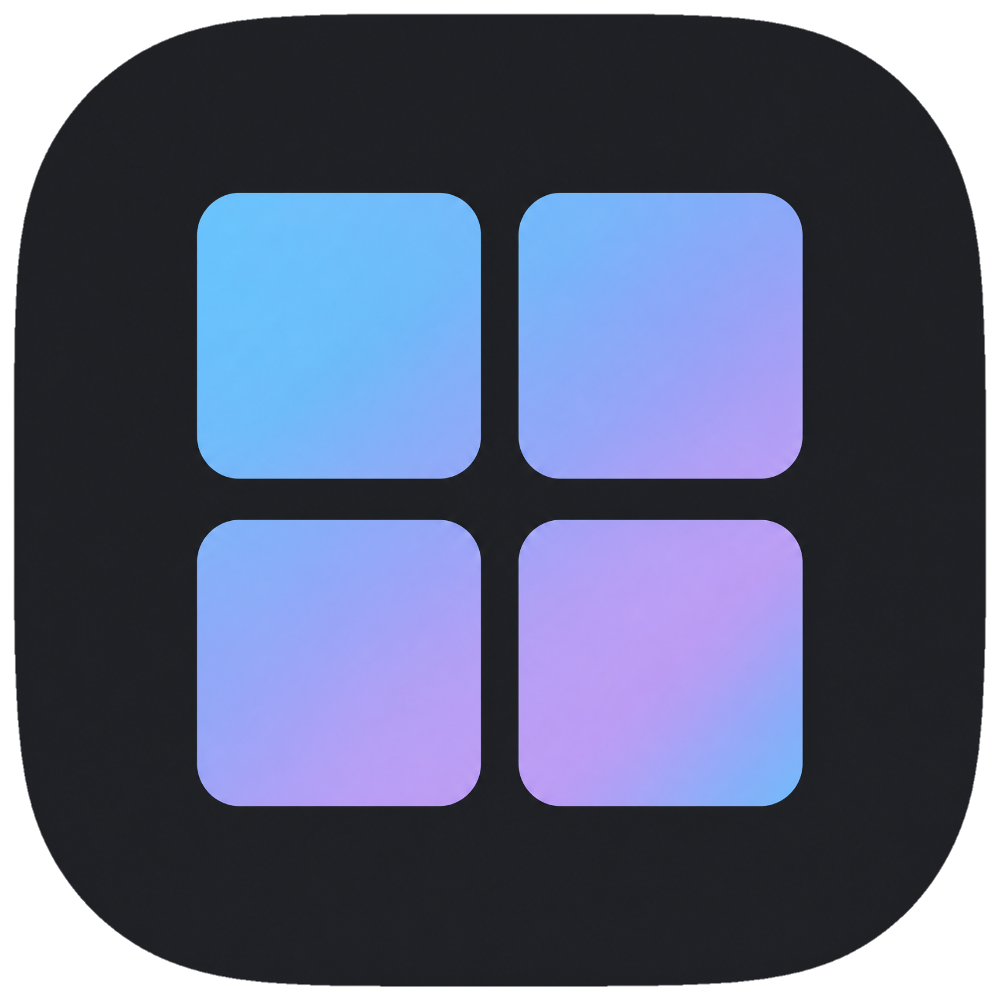
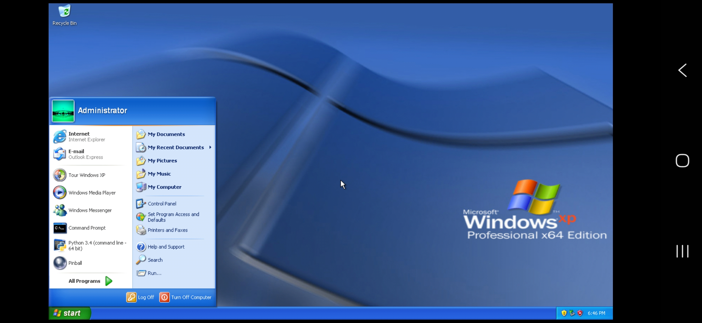
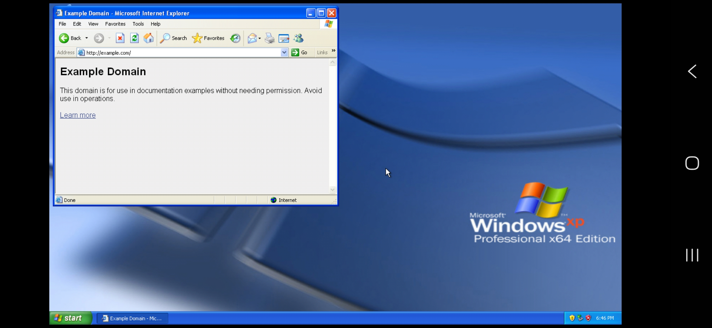
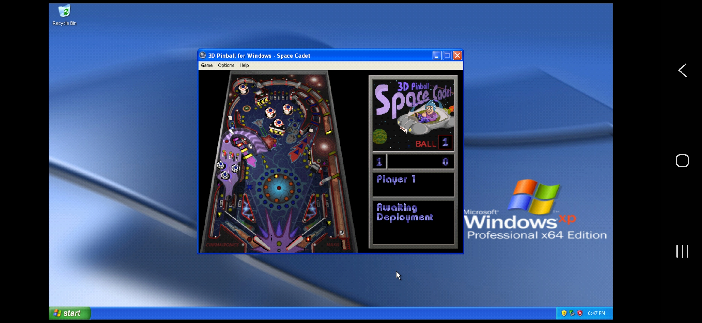

> [!WARNING]
> This project is still in an early alpha state, errors and instability are expected

  

<h1 align="center">QubeVM</h1>

QEMU-based virtual machine emulator for Android

## What it does

Emulates a full virtual machine (CPU, RAM, disk, display, sound, network) on Android, allowing installation and execution of guest operating systems (Windows, Linux, BSD, legacy OSes) inside the app

QubeVM is built upon **QEMU 11.0.2**, compiled natively for Android as a `.so` library without relying on third-party wrappers

> [!NOTE]
> QubeVM includes links to legally distributable operating systems only. Any other disk images, ISOs, or software run inside the app are the user's own responsibility.

## Preview

## Supported CPU Architecture

x86 / x86_64 for now, planning to support more in the future

### Acceleration
QubeVM offers different ways to run your virtual machine depending on your device:

| Mode | Status |
|------|--------|
| KVM | Supported for users with a custom kernel exposing /dev/kvm, hardware accelerated and significantly faster than TCG. Not available on stock Android by default, read below for more info |
| TCG (software emulation, single-threaded) | Default, works on all devices |
| MTTCG (Multi-Threaded TCG) | Supported, runs guest vCPUs on separate host threads for better SMP performance |
| High Priority Mode | Supported, runs the VM emulation thread at its greatest speed for improved performance |

> [!CAUTION]
> **High Priority Mode** may cause device overheating. Ensure your device has adequate cooling during extended sessions

## Display

Qube supports two display modes:

- **SDL**, the default mode, smooth and supports audio, good for high stability
- **VNC**, requires an external VNC client, runs at 60Hz refresh rate, good for reducing screen tearing

## Network Support

- **TAP**, bridges the guest directly to the host's network stack with its own IP, like a real physical machine. Requires root (`/dev/net/tun`)
- **User (SLIRP)**, guest sits behind a virtual router. No root needed (in short, acts like ethernet)

## KVM Support

Not available by default, stock Android does not expose `/dev/kvm` to apps, so TCG is used

Users running a **custom kernel** with KVM enabled can use KVM acceleration instead of TCG for matching host/guest architectures. Currently isn't supported because we didn't release an ARM version yet

## Translations

Contributions from translators are welcome. Feel free to open a pull request to add or improve a language
[Translation Files](translation/)

## Credits

QubeVM is a modified and improved version of the [Limbo PC Emulator](https://github.com/limboemu/limbo).
