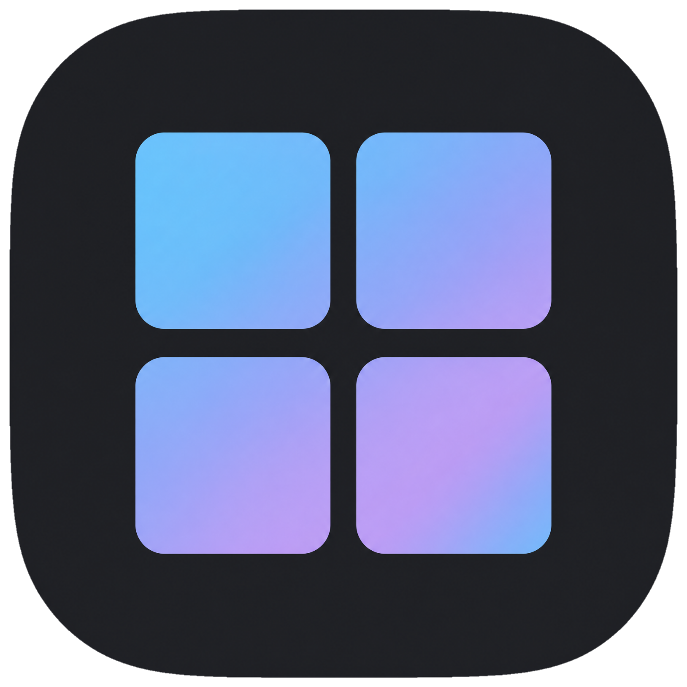

  

<h1 align="center">QubeVM</h1>

QubeVM is a QEMU-based virtual machine emulator for Android

  

## What it does

Emulates a full virtual machine on Android, allowing installation and execution of guest operating systems inside the app

QubeVM currently supports **QEMU 11.1.1 and 7.2.22**, compiled natively for Android as a `.so` library without relying on third-party wrappers

## Supported CPU Architecture

x86 / ARM / PowerPC

### Acceleration
QubeVM offers different ways to run your virtual machine depending on your device:

| Mode | Status |
|------|--------|
| KVM | Supported for users with a custom kernel exposing /dev/kvm, hardware accelerated and significantly faster than TCG. Not available on stock Android by default, read below for more info |
| TCG (software emulation, single-threaded) | Default, works on all devices |
| MTTCG (Multi-Threaded TCG) | Supported, runs guest vCPUs on separate host threads for better SMP performance |
| High Priority Mode | Runs the VM emulation thread at its greatest speed for improved performance |

> [!CAUTION]
> **High Priority Mode** may cause device overheating. Ensure your device has adequate cooling during extended sessions

## Display

Qube supports two display modes:

- **QGE (Qube Graphics Engine)**, the default mode, displays frames natively, also supports native audio output using AAudio, The default and recommended option
- **VNC (Virtual Network Computing)**, requires an external VNC client, uses more resources

## Network Support

- **TAP**, bridges the guest directly to the host's network stack with its own IP, like a real physical machine. Requires root (`/dev/net/tun`)
- **User (SLIRP)**, guest sits behind a virtual router. No root needed (in short, acts like ethernet)

## KVM Support

Not available by default, stock Android does not expose `/dev/kvm` to apps, so TCG is used as default Accelerator

Users running a **custom kernel** with KVM enabled can use KVM acceleration instead of TCG for matching host/guest architectures.

## Docs
For a detailed information, check the [Docs](docs/index.md)

## Contributions
Contributions from people are always welcome,
But please make sure of how practical is the code before the pull request

## License
The QubeVM project is licensed under the **GPL-3.0**
See [COPYING](COPYING) for more info

## Credits

QubeVM is a forked and improved version of the [Limbo PC Emulator](https://github.com/limboemu/limbo), however it depends on these projects:

- [qemu](https://github.com/qemu/qemu)
- [glib](https://gitlab.gnome.org/GNOME/glib.git)
- [virglrenderer](https://gitlab.freedesktop.org/virgl/virglrenderer)
- [libepoxy](https://github.com/anholt/libepoxy)
- [pixman](https://gitlab.freedesktop.org/pixman/pixman)
- [libffi](https://github.com/libffi/libffi)

QubeVM also uses some code from:
- [avnc](https://github.com/gujjwal00/avnc) Virtual keys, ported to QubeVM
